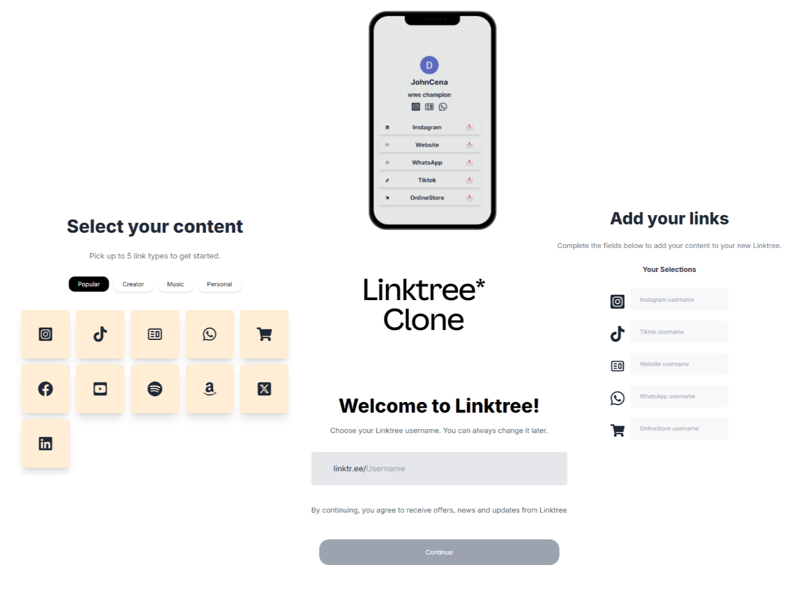

# NextLink: A Modern Linktree Alternative

NextLink is a powerful Linktree clone built with Next.js 14, Prisma, PostgreSQL, and Auth.js. It provides a sleek, customizable platform for users to aggregate and share their important links in one place.

## Features

- **Next.js 14**: Utilizes the latest Next.js features for optimal performance and developer experience
- **Prisma & PostgreSQL**: Robust database management for reliable data storage and retrieval
- **Auth.js Integration**: Secure authentication system to protect user accounts
- **Customizable Profiles**: Users can personalize their link pages with profile pictures and bios
- **Multiple Link Types**: Support for various platforms including Instagram, Website, WhatsApp, TikTok, and Online Stores
- **Responsive Design**: Looks great on both desktop and mobile devices
- **Easy Link Management**: Simple interface for adding, editing, and removing links

 

## Getting Started

1. Clone the repository
2. Install dependencies: `npm install`
3. Set up your PostgreSQL database
4. Configure your environment variables
5. Run migrations: `npx prisma migrate dev`
6. Start the development server: `npm run dev`

## Contributing

Contributions are welcome! Please feel free to submit a Pull Request.

## License

This project is licensed under the MIT License - see the [LICENSE.md](LICENSE.md) file for details.

 

 
